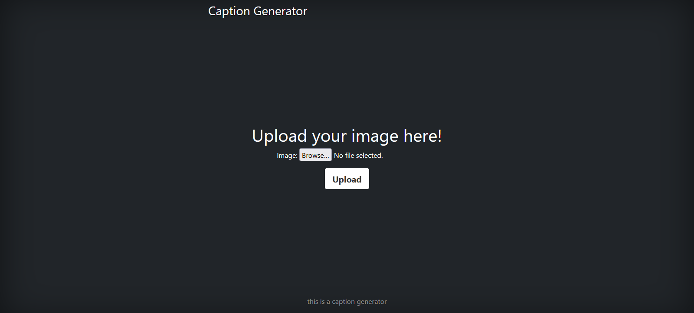
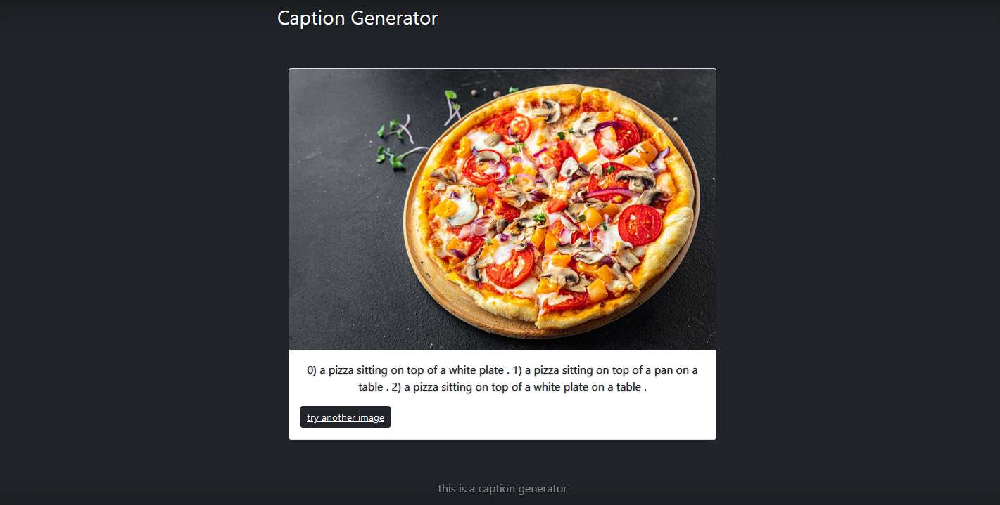

# CaptionGenerator

I built a user interface for Deep learning model with django. this model will provide a caption for images.

## How to use this
1) I used [im2txt](https://github.com/HughKu/Im2txt) to generate captions. so you must download [inceptionv3 finetuned parameters over 1M](https://drive.google.com/open?id=1r4-9FEIbOUyBSvA-fFVFgvhFpgee6sF5) first.
2) you will get 4 files, and you must put them into this path `im2txt/model/Hugh/train/`
* **newmodel.ckpt-2000000.data-00000-of-00001**
* **newmodel.ckpt-2000000.index**
* **newmodel.ckpt-2000000.meta**
* **checkpoint**
3) now you can run this command `docker-compose up -d --build` and after that open `127.0.0.1:8000`.

## Some Images
menu:

output:

